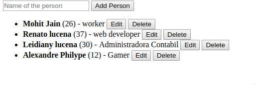

# Otimização Do Backbone.Js
## Como usar templates no backbone js - Learning Backbone js

- Tutorial de: Mohit Jain

## Link do artigo.
- http://www.codebeerstartups.com/a-complete-guide-for-learning-backbone-js/

- Introdução e Instalação
- Representando seus dados em javascript
- Definindo Modelos no backbone js
- Adicionando Validações no backbone de modelos js
- Explicando visões no backbone js
- Como usar modelos no backbone js
- Como melhorar modelos no backbone js
- Coleções no backbone js
- Visualizações de coleção no backbone js
- Ajudantes de modelo no backbone js
- Como usar o namespace no backbone js
- Como lidar com eventos dom no backbone js e definir seus eventos personalizados ( Live Demo )
- Roteamento no backbone js

- Renato Lucena
